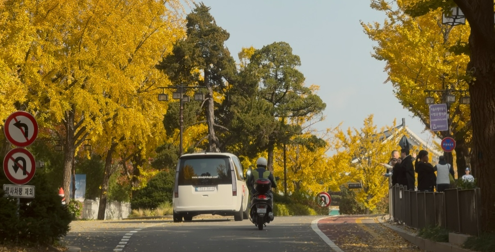
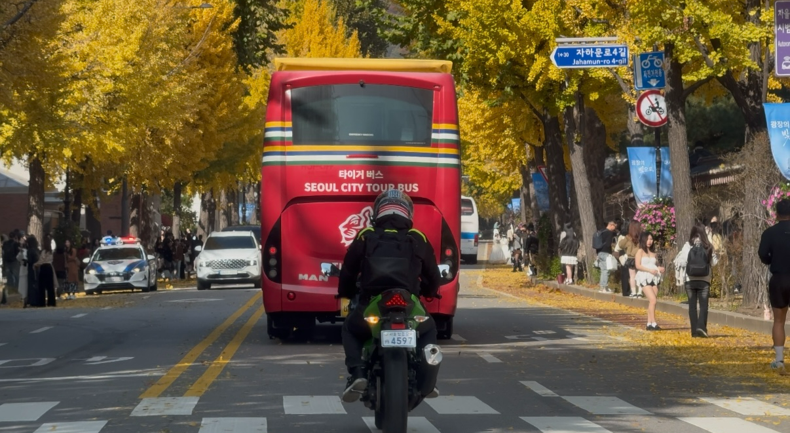
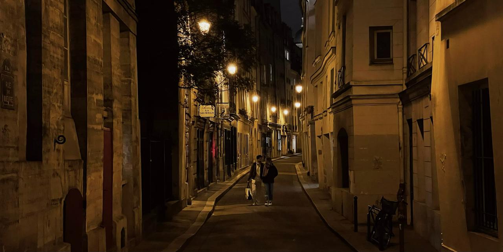
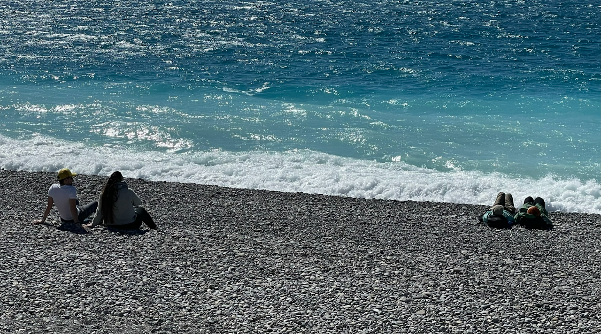

## 1) 취향과 철학

삶의 즐거움을 위하여 취향과 철학을 가꾸고자 노력하고 있습니다. 커피, 음악, 공간, 책, 운동, 맑은 하늘을 좋아합니다.

## 2) 정신건강과 웰니스

정신건강을 챙기는 행복한 삶을 지향합니다. 운동은 **주5일** 합니다. 러닝, 축구, 필라테스, 웨이트 등 가리지 않고 꾸준히 하고 있습니다. 수면, 식사 등 웰니스에도 관심이 많습니다.

햇살 좋은 광장에서 오후 2시에 커피를 한 잔 하고, 한강에서 노을을 보면서 노을지기 전의 햇살을 캐치하는 여유로운 마음으로 하루를 마무리하는 가을방학 같은 삶을 꿈꾸고 있습니다.

## 3) 공간, 사진, 영상, 음악

도시 곳곳을 돌아다니며 공간을 탐방합니다. 사진과 영상을 남기는 것을 좋아합니다. 영화는 주로 드라마 장르를 좋아합니다. 옷 입는 것에도 약간 관심이 있으며, 주로 올블랙을 선호합니다.

그루브 있는 음악이라면 록, 전자음악, 재즈, R&B, 인디 등 가리지 않고 좋아하며, 매년 록 페스티벌을 즐기는 편입니다. 이전에 밴드 활동하며 베이스기타 연주를 했었습니다.

### 좋아하는 음악

- **Electronic / French touch / Minimal / Synth-based** — Kraftwerk, Dabeull, Breakbot, Air, Paradis, FKJ, Polo & Pan, L'Impératrice
- **Funk / Groove-based Indie / Nu-disco / Neo-soul** — Vulfpeck, Jungle, Parcels, Papooz, Leisure, Tom Misch, Men I Trust, Rhye, The Internet, Benny Sings
- **Alternative / Rock / Funk-rock** — Oasis, Liam Gallagher, Beck, Red Hot Chili Peppers
- **Korean Indie / Urban / Session-oriented Korean Music** — 구남과여라이딩스텔라, 새소년, 김사월, wave to earth, 조정현, 김현식, 빛과 소금, The Black Skirts, 혁오, ADOY, 한로로, 까데호, 지소쿠리클럽, 다섯, 전진희, 이설아, 김일두, 사뮈 등 다수
- **Jazz / Contemporary Jazz / Jazz-fusion** — Keith Jarrett, Pat Metheny Group, Brad Mehldau, Esbjörn Svensson Trio, Bill Evans

## 4) 사회 변화에 대한 기여

사회 변화에 기여할 수 있는 삶을 살려고 합니다. 저는 서로를 돌보고, 도전을 장려하며, 실패하더라도 감당할 수 있는 기반을 가진 지속가능한 공동체가 필요하다고 생각합니다. 자살률, 합계출산율, 산업재해 사망자 수와 같은 지표는 우리 사회의 구조적 문제를 보여주며, 사회적 결정요인(social determinants)과 깊이 연결되어 있습니다. 앞으로 사회적 불평등을 완화하여 더 행복하고 안전하며 지속가능한 사회를 만드는 데 기여하는 삶을 살아가고자 노력하고자 합니다.

## 갤러리

::: {layout-ncol=3}

:::
